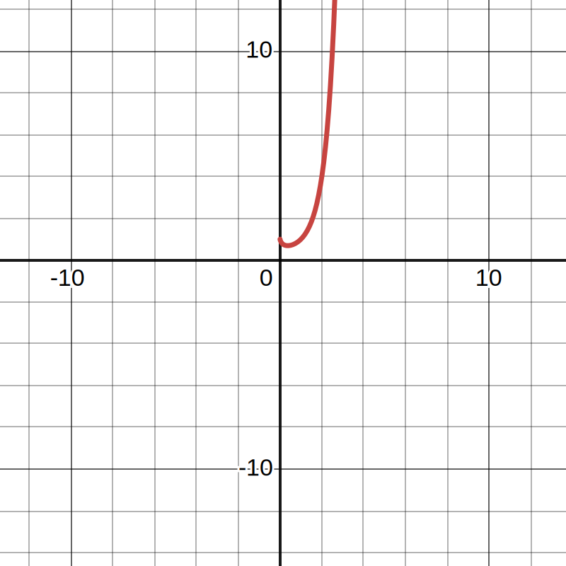

# Math Quiz

## 1.

## 2.

## 3.

## 4.
Adott az $(n^2)^n - 2n^n + 1 = 0$ egyenlet.

Ha $n < 0$ és a kifejezés definiált, akkor:

- $(n^2)^n > 0$ (mivel $n^2$ pozitív, és minden hatványra emelt pozitív szám pozitív), és
- $-2n^n > 0$ (mivel $n^n$ negatív páratlan egész számok esetén negatív, így $-2n^n$ pozitív).

Tehát $(n^2)^n - 2n^n + 1 > 0$

$n < 0$ esetén nincs megoldás.

$$
\begin{align}
f(n) = n^n \text{ ábrázolva}
\end{align}
$$

Tehát csak akkor keressük a megoldást, ha $n > 0$.

$n > 0$ esetén:

$$
(n^2)^n = (n^n)^2
$$

Helyettesítsük be az eredeti egyenletbe:

$$
(n^n)^2 - 2n^n + 1 = 0
$$

Legyen $x = n^n$, akkor:

$$
x^2 - 2x + 1 = 0 \\
(x - 1)^2 = 0 \\
x = 1
$$

Tehát $n^n = 1$, ami azt jelenti hogy $n = 1$

## 5.
Legyen $T = \text{teknős}, C = \text{cica}, A = \text{asztal}$

Ha a két ábrát egymásra tesszük:

$$
2A + 1T + 1C = 170\text{cm} + 1C + 1T \\
130 + C + 170 + T = 2A + M + T
300 = 2A
$$
Tehát $A = 150\text{cm}$

## 6.
Legyen $C = \text{cica}, K = \text{kutya}, P = \text{patkány}$

$$
10 + 20 + 24 = 2C + 2K + 2P \\
54 = 2 * (M+K+P)
$$

Tehát $M + K + P = 27\text{kg}$

## 7.

## 8.

## 9.

## 10.
