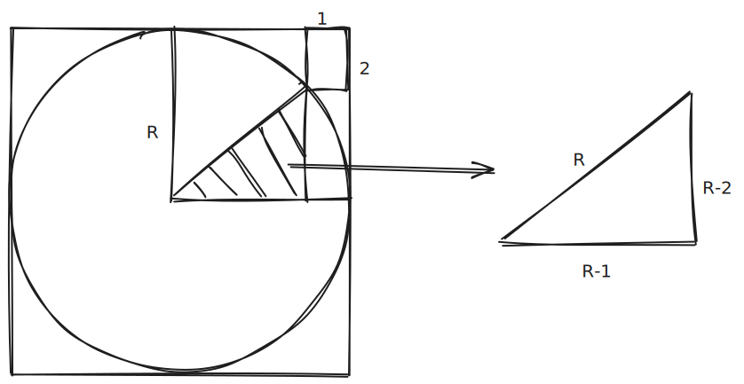

# Math Quiz

## 1.

Innentől egy Pitagorasz tétellel megoldható.

$$
(R-1)^2+(R-2)^2=R^2 \\
R^2-2 \times R+1+R^2-4 \times R+4=R^2 \\
R^2-6 \times R+5=0 \\
R_{1,2} = \frac{6 \pm \sqrt{36-20}}{2}\\
= 1 \text{nem lehet} \\
= 5
$$

## 2.

## 3.

$$\frac{1}{\sqrt{1} + \sqrt{2}} + \frac{1}{\sqrt{2} + \sqrt{3}} + \frac{1}{\sqrt{3} + \sqrt{4}} + \cdots + \frac{1}{\sqrt{99} + \sqrt{100}} = ?$$

Gyöktelenítjük a nevezőket, előtte a nevezőkben felcseréljük a tagokat

$$\frac{1}{\sqrt{2} + \sqrt{1}} + \frac{1}{\sqrt{3} + \sqrt{2}} + \frac{1}{\sqrt{4} + \sqrt{3}} + \cdots + \frac{1}{\sqrt{100} + \sqrt{99}} =$$

$$\frac{\sqrt{2} - \sqrt{1}}{(\sqrt{2} + \sqrt{1})(\sqrt{2} - \sqrt{1})} + \frac{\sqrt{3} - \sqrt{2}}{(\sqrt{3} + \sqrt{2})(\sqrt{3} - \sqrt{2})} + \frac{\sqrt{4} - \sqrt{3}}{(\sqrt{4} + \sqrt{3})(\sqrt{4} - \sqrt{3})} + \cdots + \frac{\sqrt{100} - \sqrt{99}}{(\sqrt{100} + \sqrt{99})(\sqrt{100} - \sqrt{99})}$$

$$\frac{2-1}{1} + \frac{3-2}{1} + \frac{4-3}{1} + \cdots + \frac{100-99}{1}$$

$$(\sqrt{2} - \sqrt{1}) + (\sqrt{3} - \sqrt{2}) + (\sqrt{4} - \sqrt{3}) + \cdots + (\sqrt{100} - \sqrt{99})$$

Mindegyiknek van párja, amik kiejtik egymást, ezért $\sqrt{100} - \sqrt{1} = 10 - 1 = 9$ a végeredmény.

## 4.
Adott az $(n^2)^n - 2n^n + 1 = 0$ egyenlet.

Ha $n < 0$ és a kifejezés definiált, akkor:

- $(n^2)^n > 0$ (mivel $n^2$ pozitív, és minden hatványra emelt pozitív szám pozitív), és
- $-2n^n > 0$ (mivel $n^n$ negatív páratlan egész számok esetén negatív, így $-2n^n$ pozitív).

Tehát $(n^2)^n - 2n^n + 1 > 0$

$n < 0$ esetén nincs megoldás.

$$
\begin{align}
f(n) = n^n \text{ ábrázolva}
\end{align}
$$

Tehát csak akkor keressük a megoldást, ha $n > 0$.

$n > 0$ esetén:

$$
(n^2)^n = (n^n)^2
$$

Helyettesítsük be az eredeti egyenletbe:

$$
(n^n)^2 - 2n^n + 1 = 0
$$

Legyen $x = n^n$, akkor:

$$
x^2 - 2x + 1 = 0 \\
(x - 1)^2 = 0 \\
x = 1
$$

Tehát $n^n = 1$, ami azt jelenti hogy $n = 1$

## 5.
Legyen $T = \text{teknős}, C = \text{cica}, A = \text{asztal}$

Ha a két ábrát egymásra tesszük:

$$
2A + 1T + 1C = 170\text{cm} + 1C + 1T \\
130 + C + 170 + T = 2A + M + T
300 = 2A
$$
Tehát $A = 150\text{cm}$

## 6.
Legyen $C = \text{cica}, K = \text{kutya}, P = \text{patkány}$

$$
10 + 20 + 24 = 2C + 2K + 2P \\
54 = 2 * (M+K+P)
$$

Tehát $M + K + P = 27\text{kg}$

## 7.
Annak az esélye hogy sem Anna, sem Balázs nem dob hatost az első körben $(\frac{5}{6})^2$.

Amennyiben ez megtörténik, a kör végével a játék "újraindul", tehát az esélyek egyenlőek a kezdeti esélyekkel.

Emiatt:
$$
\text{esély} = \frac{1}{6}+\frac{25}{36}\times p
$$
Tehát $\text{esély} = \frac{6}{11}$.